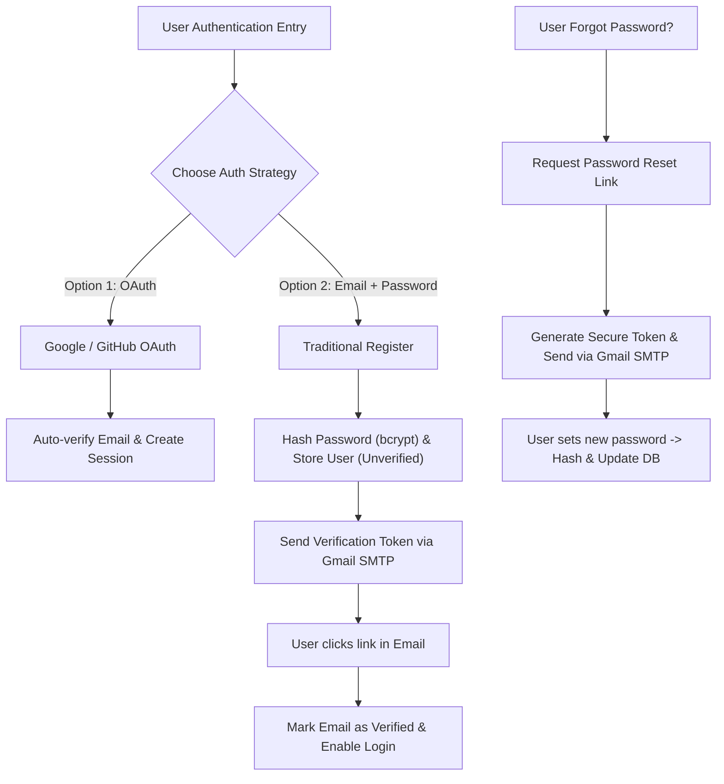
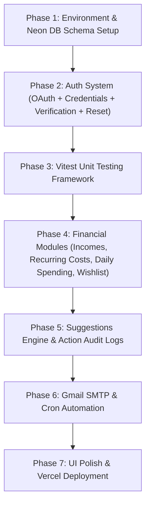

# Monify Project Exploration & Development Plan (Updated)

This document outlines the architecture, TypeScript setup, Shadcn UI workflows, database schema, hybrid authentication, automation, unit testing, and step-by-step master plan for building the **Monify Money Management Application**.

---

## 1. Project Exploration & Architecture Overview

### Folder Structure
The repository is structured following Next.js App Router and Shadcn UI v4 conventions:

```
monify/
├── app/                      # Next.js App Router pages, layouts, and API routes
│   ├── (auth)/              # Auth routes (/login, /register, /verify-email, /forgot-password, /reset-password)
│   ├── (dashboard)/         # Protected dashboard routes (/dashboard, /income, /expenses, /wishlist, /logs)
│   ├── api/                 # REST & Cron API routes (/api/cron/send-digest, /api/auth/[...nextauth])
│   ├── globals.css          # Tailwind CSS v4 + Shadcn tokens & custom variants
│   ├── layout.tsx           # Root layout wrapper with theme provider
│   └── page.tsx             # Landing page entry point
├── components/              # React components
│   ├── auth/                # Auth forms (LoginForm, RegisterForm, ResetPasswordForm)
│   ├── ui/                  # Shadcn UI primitives (e.g. button.tsx, card.tsx)
│   └── theme-provider.tsx   # Next-themes provider wrapper
├── hooks/                   # Custom React hooks
├── lib/                     # Core utilities, financial calculators, auth logic, and DB client
│   ├── auth/                # Auth.js / NextAuth options, bcrypt hashing, token generation
│   ├── db/                  # Drizzle ORM schema & Neon Postgres client
│   ├── email/               # Nodemailer Gmail SMTP client & email templates (verification, reset, digest)
│   ├── financial/           # Pure calculation functions (Unit tested)
│   └── utils.ts             # Class merging helper (cn function)
├── tests/                   # Vitest unit & integration tests
│   ├── auth.test.ts         # Unit tests for token generation, password hashing & verification
│   ├── financial.test.ts    # Unit tests for financial calculations & suggestions
│   └── email.test.ts        # Unit tests for email template generator
├── components.json          # Shadcn CLI configuration file
├── next.config.ts           # Next.js configuration
├── tsconfig.json            # TypeScript compiler configuration
└── package.json             # Dependencies and build scripts
```

### Key Technical Specs

| Layer | Technology | Description |
| :--- | :--- | :--- |
| **Framework** | **Next.js 16 (App Router)** | Full-stack React 19 framework |
| **Styling & UI** | **Tailwind CSS v4 + Shadcn UI** | Accessible UI primitives (`@base-ui/react`) & dark theme |
| **Database** | **Neon PostgreSQL** | Serverless Cloud Postgres |
| **ORM** | **Drizzle ORM** | Type-safe SQL ORM optimized for Neon serverless |
| **Authentication** | **Auth.js v5 (Hybrid)** | Choice of **OAuth 2.0 (Google/GitHub)** OR **Traditional Email + Password** (JWT / Database Sessions) |
| **Email Features** | **Nodemailer + Gmail SMTP** | Email verification, Password reset tokens, Action logs, and Weekly digest emails |
| **Automation** | **Node-cron / Vercel Cron** | Scheduled jobs for recurring expense processing & weekly email digests |
| **Unit Testing** | **Vitest + React Testing Library** | Fast unit tests for auth tokens, financial calculations, suggestions & emails |
| **Deployment** | **Vercel** | Serverless deployment with edge support and Vercel Cron |

---

## 2. Authentication Choices & Workflow Architecture

Monify supports **dual authentication modes**:



### Key Authentication Features:
1. **OAuth 2.0 (Google & GitHub)**: One-click instant login via Auth.js providers.
2. **Traditional Email & Password**:
   - Secure password hashing using `bcryptjs`.
   - Flexible Session strategy: JWT-based stateless tokens or database-persisted sessions.
3. **Email Verification**:
   - Upon registration, an unverified user receives a unique 64-character verification token via Gmail SMTP.
   - Protected routes enforce email verification before granting dashboard access.
4. **Forgot & Reset Password Workflow**:
   - `/forgot-password` generates a time-limited token (expires in 1 hour).
   - `/reset-password?token=...` allows resetting password with unit-tested token validation.

---

## 3. Database Schema Design (Neon PostgreSQL + Drizzle ORM)

```mermaid
erDiagram
    USERS ||--o{ ACCOUNTS : connects
    USERS ||--o{ SESSIONS : has
    USERS ||--o{ VERIFICATION_TOKENS : receives
    USERS ||--o{ PASSWORD_RESET_TOKENS : requests
    USERS ||--o{ INCOME_SOURCES : earns
    USERS ||--o{ RECURRING_EXPENDITURES : pays
    USERS ||--o{ DAILY_EXPENDITURES : spends
    USERS ||--o{ WISHLIST_ITEMS : targets
    USERS ||--o{ ACTION_LOGS : generates

    USERS {
        uuid id PK
        string email UK
        timestamp email_verified_at
        string password_hash "Nullable for OAuth"
        string name
        string image
        string currency
        timestamp created_at
    }

    ACCOUNTS {
        uuid id PK
        uuid user_id FK
        string type
        string provider
        string provider_account_id
    }

    SESSIONS {
        uuid id PK
        uuid user_id FK
        string session_token UK
        timestamp expires
    }

    VERIFICATION_TOKENS {
        string identifier "email"
        string token UK
        timestamp expires
    }

    PASSWORD_RESET_TOKENS {
        string email
        string token UK
        timestamp expires
    }

    INCOME_SOURCES {
        uuid id PK
        uuid user_id FK
        string title
        decimal amount
        string source_type "salary | freelance | payout | investment | side_hustle | other"
        string frequency "monthly | one_time | weekly | annual"
        timestamp date
    }

    RECURRING_EXPENDITURES {
        uuid id PK
        uuid user_id FK
        string title
        decimal amount
        string category "rent | bills | subscriptions | insurance | loan | other"
        string billing_cycle "monthly | quarterly | annual"
        integer due_day_of_month
    }

    DAILY_EXPENDITURES {
        uuid id PK
        uuid user_id FK
        string title
        decimal amount
        string category "food | transport | shopping | entertainment | healthcare | other"
        timestamp date
        string notes
    }

    WISHLIST_ITEMS {
        uuid id PK
        uuid user_id FK
        string title
        decimal target_price
        string priority "low | medium | high"
        string status "saving | achieved | cancelled"
        timestamp target_date
    }

    ACTION_LOGS {
        uuid id PK
        uuid user_id FK
        string action_type
        string description
        jsonb metadata
        timestamp created_at
    }
```



---

## 4. Gmail SMTP Email Templates

Emails are dispatched via Nodemailer connected to Gmail SMTP (`smtp.gmail.com`):

1. **Email Verification Template**:
   - Clean HTML template with verification button (`/verify-email?token=...`).
2. **Password Reset Template**:
   - Secure reset button (`/reset-password?token=...`) with 1-hour expiration notice.
3. **Weekly Financial Digest & Suggestions Template**:
   - Dynamic table of weekly income vs costs, net savings rate, spending alerts, and wishlist progress.
4. **Action Audit Alert Template**:
   - Instant security notification when critical settings or password changes occur.

---

## 5. Unit Testing Strategy (Vitest)

### Test Coverage:
1. **Auth & Security Logic (`tests/auth.test.ts`)**:
   - Password hashing and verification using `bcryptjs`.
   - Verification token generation and expiration calculations.
   - Password reset token validity checks.
2. **Financial Math (`tests/financial.test.ts`)**:
   - Aggregating incomes (salary + freelance + payouts).
   - Summing fixed recurring costs (rent + bills + subscriptions).
   - Net monthly savings calculation.
   - Wishlist purchase feasibility timeline.
3. **Suggestions Engine (`tests/suggestions.test.ts`)**:
   - Spending thresholds & alert generation.
4. **Email Template Formatting (`tests/email.test.ts`)**:
   - Verification link & password reset link token URL generation.

---

## 6. Step-by-Step Implementation Roadmap



### Phase 1: Environment & Database Setup
* Configure Neon PostgreSQL credentials in `.env`.
* Run Drizzle migrations for users, tokens, income, expenditures, wishlist, and action logs.

### Phase 2: Hybrid Authentication Implementation
* Install NextAuth v5, bcryptjs, and Auth.js Drizzle adapter:
  ```bash
  npm install next-auth@beta @auth/drizzle-adapter bcryptjs
  npm install -D @types/bcryptjs
  ```
* Build pages:
  - `/register`: Email + Password registration.
  - `/login`: Dual options (OAuth button OR Email/Password form).
  - `/verify-email`: Verification token processor.
  - `/forgot-password` & `/reset-password`: Password recovery flow.

### Phase 3: Unit Testing Setup
* Install Vitest:
  ```bash
  npm install -D vitest @testing-library/react @testing-library/jest-dom jsdom
  ```
* Run `npm run test` to verify auth token math and financial formulas.

### Phase 4: Financial Core Modules
* Build forms & dashboard tables for multi-stream incomes, recurring expenditures (rent, subscriptions), daily expenses, and wishlist progress.

### Phase 5: Action Audit Logging & Smart Suggestions
* Record audit logs into `action_logs` table upon user operations.
* Render financial health scores and automated cost-cutting tips.

### Phase 6: Gmail SMTP & Cron Automation
* Configure Nodemailer Gmail transporter.
* Create `/api/cron/send-digest` API route for Vercel Cron.

### Phase 7: Deployment on Vercel
* Set environment variables on Vercel (`DATABASE_URL`, `AUTH_SECRET`, `SMTP_USER`, `SMTP_PASS`, `CRON_SECRET`, `GOOGLE_CLIENT_ID`, `GITHUB_CLIENT_ID`).
* Deploy and verify clean build (`npm run build`, `npm run typecheck`, `npm run test`).
